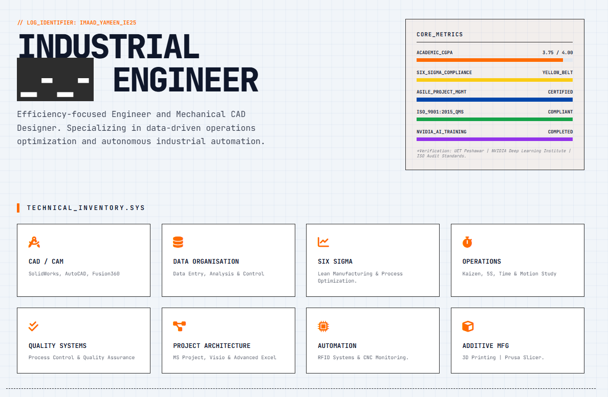

# [SYSTEM_LOG]: INDUSTRIAL_PORTFOLIO_V2
**Operator:** Engr. Imaad Ullah Khan Yameen  
**Link:** [https://yameenimaad.github.io/Porfolio_IUKY/](https://yameenimaad.github.io/Porfolio_IUKY/)

---

## 🖥️ SYSTEM_INTERFACE_PREVIEW

---

## 🛠️ TECHNICAL_SPECIFICATIONS
This terminal is built to showcase high-efficiency engineering operations and CAD design capabilities.

### 🏗️ CORE_STACK
- **Frontend:** HTML5 / Tailwind CSS (Industrial UI Kit)
- **Logic:** JavaScript (Dynamic PKT Time-Sync & Theme Engine)
- **Deployment:** GitHub Pages (Automated CI/CD)

### 📊 OPERATIONAL_METRICS
- **Academic:** 3.75/4.00 CGPA (UET Peshawar)
- **Quality:** Six Sigma Yellow Belt & ISO 9001:2015 Compliant
- **Automation:** NVIDIA Deep Learning Institute Certified

---

## 📁 DOCUMENT_ARCHIVE
The following technical records are accessible via the live dashboard:
1. **Full_Resume_2026.pdf** - Professional IE Work History
2. **Training_Credentials** - Multi-doc folder containing Lean & AI certifications
3. **FYDP_Technical_Specs** - UAV Inventory Automation Project (3rd Position Awarded)

---

## 📸 PROJECT_GALLERY

---

## 📟 CONTACT_ACCESS
- **LinkedIn:** [Imaad Ullah Khan Yameen](https://www.linkedin.com/in/imaad-ullah-khan-yameen/)
- **Email:** yameenimaad@gmail.com
- **Status:** `[READY_FOR_DEPLOYMENT]`
